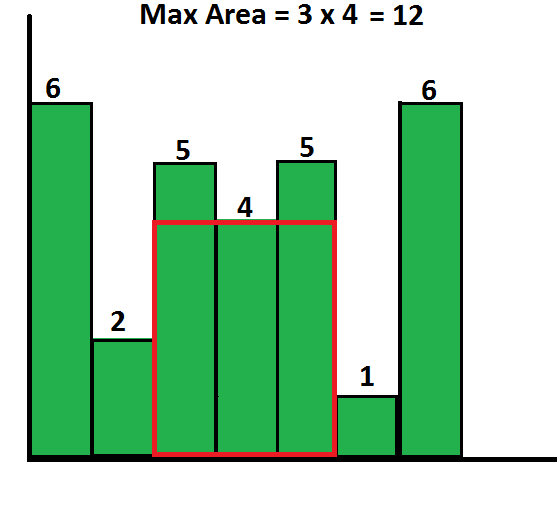

Max Area in a histogram
===========================================================================
  Find the largest rectangular area possible in a given histogram where the
  largest rectangle can be made of a number of contiguous bars. For simplicity,
  assume that all bars have same width and the width is 1 unit.
  
  For example, consider the following histogram with 7 bars of heights {6, 2,5,
  4, 5, 2, 6}. The largest possible rectangle possible is 12
  
  
  <div style="page-break-after: always;"></div>
  
Key Points
====================

 1. O(n) space complexity O(n)
 2. Approach uses stack
 3. Also NLOGN ( Divide and conquer approach possible)
		 
				 

Key Questions to Ask
====================
1. Can I use additional data structures

Approaches
====================

1. The key idea is to keep track of start and end of every sub-rectangle formed. When a bar is first read, it could either start a new sub rectangle or add to the previous rectangle 
  1. When will it start a new sub-rectangle? 
    1. When the value of the bar is < the bar to its left Add every new sub-rectangle to the stack
  1. When will it add to the prev subrectangle ? 
      1. when it is >= the previous previous bar- Keep pushing to the stack 
  1. When will the current sub-rectangle end?
      1. When the value of the bar is < the bar to its left. It starts a new sub rectangle and ends the
	  previous sub-rectangle. <b>Pop the previous bar out of the stack and calculate the area contributed by the bar to its sub rectangle</b>
	  Maintain a running max and return the max rectangle
	  
	  
<b>Calculating Area</b>


Calculation of area is key in solving this.
 When we pop out a bar ( after encountering a bar < than the top) we need to
				  calculate the area contributed by the bar being popped out.
<pre>				  
Area contributed by the popped bar= 
           height of the bar  (
				  number of contiguous bars >= height say M) 
		  M=current index -
				  new top of the stack -1
				  
if after popping the stack is empty just multiply the height
				  by the current index
</pre>				  
<b>After completion of array if the stack is still not empty, we need to pop out one at a time and calculate the area contributed by each area with same formula as above ( just that instead of index it will be the length of the array)
</b>

 if the stack is empty which means we have encountered the least element in the array and hence we multiply it by the length of the array
 ``` java

    Deque<Integer> stack = new LinkedList<>();
		int maxArea = 0;
		for (int i = 0; i < a.length;) {
			if (stack.isEmpty() || a[i] >= a[stack.peekFirst()]) {
				stack.push(i++);
			} else {
				int index = stack.pop();

				/**
				 * Calculation of area is key in solving this. When we pop out a
				 * bar ( after encountering a bar < than the top) we need to
				 * calculate the area contributed by the bar being popped out.
				 * 
				 * Area contributed by the popped bar= height of the bar * (
				 * number of contiguous bars >= height say M) M=current index -
				 * new top of the stack -1
				 * 
				 * if after popping the stack is empty just multiply the height
				 * by the current index
				 */
				int area = a[index] * (stack.isEmpty() ? i : i - stack.peekFirst() - 1);
				maxArea = Math.max(maxArea, area);
			}
 ```
 <div style="page-break-after: always;"></div>
Sample Output
=====================
6,2,6,4,6,2
12
References
====================
http://www.geeksforgeeks.org/largest-rectangle-under-histogram/
