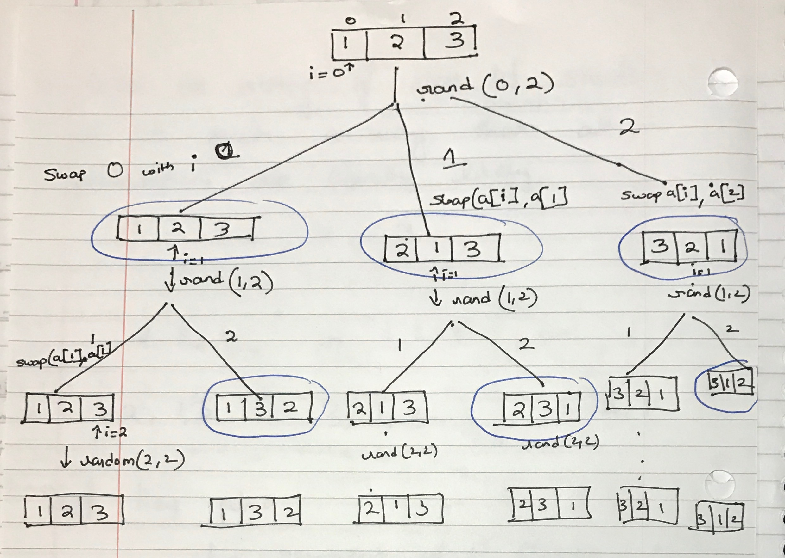

Array of size N shuffle in such a way all permutations equally likely
===========================================================================
Example : Given an array {1,2,3} different permutations possible are 

2,3,1 | 1,2,3 | 1,3,2 | 2,1,3 | 3,1,2 | 3,2,1

The algorithm should shuffle through the array and return a permutation in a such a way that any of the permutation listed above had a equal chance

Key Points
====================

1. <b>Number of permutations possible with N elements is N!</b>
2. Need access to a function or tool to generate a random number ( with uniform likelihood)
3. Why only elements in right and not all elements? - 
 ** First element can be replaced in N ways, second element in N-1 ways and so on. Overall number of outcomes is N!
 ** If we have N! permutations if we generate a multiple of N! we still get a probability of 1/N!
 ** It is necssary that we generate a multiple of N! outcomes.
 ** If all elements ( not just right) are swapped , then each element has N ways to get replaced.  The total number of permutations is NN. 
 ** if the probability has to be multiple of N! NN should be divisible by N!. Which is not the case as there could be some primes in the denominator that cannot be cancelled out
4. Duplicates will not affect the solution

Key Questions to Ask
====================
1. What all do I have access to? ( eg will there be a random function given)
2. Is there a possibility of duplicates?

Approaches
====================
Say we are given access to a function that generates a random number in a given range with equal likelihood

1. Brute Force
	a. Generate all permutations of the given array. 
	b. Store them all in a list/array.
	c. Generate a random index using the random function provided
	d. return the array at the random index
	
	Time complexity of brute force is O(N!)
	Space complexity -
	<b>Permutation is a recursive call. Hence the call stack is N deep</b>
	N! elements in each array of permutations. 
	
	Space complexity is hence O(N*N!) ~ O(N!)

2. <b>Optimal</b>Pick each element in the array and swap it with a random element on the right

Example 

References
====================

https://en.wikipedia.org/wiki/Fisher%E2%80%93Yates_shuffle
